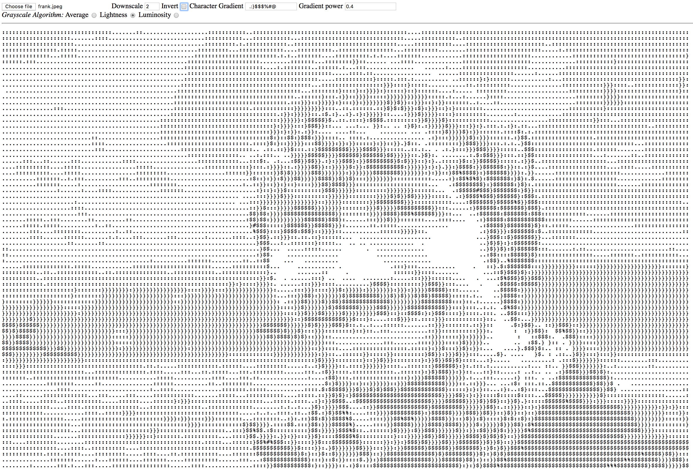

# img2asc

This project is a zero dependency, fine grained image to text converter, in which you have the ability to control various parameters, including:

- The text "colour palette"
- Mapping curve
- Grayscaling algorithm (for computing pixel brightness)
- Downsampling

## Colour palette

The colour palette is just a string of text characters, for example:

` .:}$%#@`

## Mapping curve

The mapping curve allows you to control how brightness values of pixels are mapped to the color palette. This is exposed through the `pow` value, which is the exponent used to create the curve. The default value is 1 (linear mapping).

## Grayscaling algorithm

Can choose between `average`, `lightness`, or `luminosity`.

## Downsampling

Larger images can be naively downsampled to produce smaller text outputs.